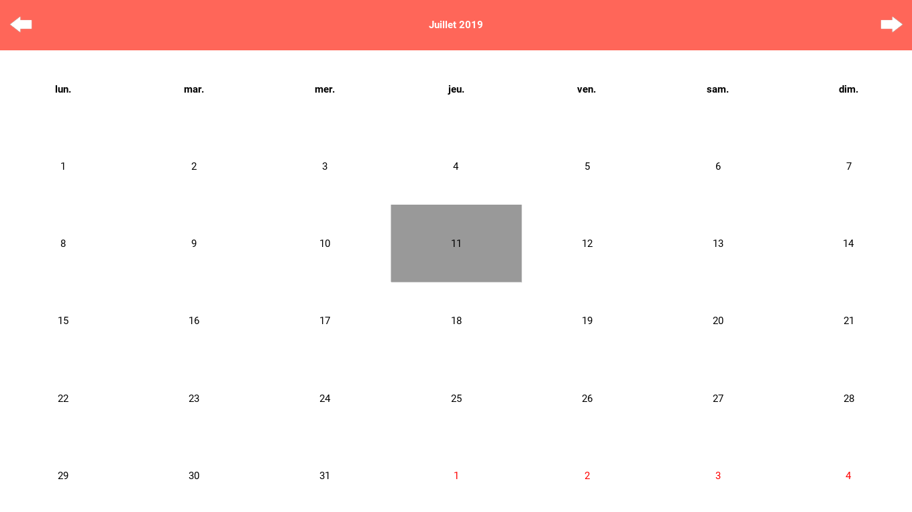

Kivy Garden - Calendar Widget
=============================

This Widget is based on [Oleg Kozlov (xxblx) work](https://bitbucket.org/xxblx/kivycalendar/).

Install
--------

`garden install calendar_widget`

#### Usage

Import the module with the following instruction:
`from kivy.garden.calendar_widget import Calendar`

And you'll be able to use the `Calendar` widget.

See [example](./example/) for more infos.

TODO
-------

- Place it in the Garden for real !
- PEP257 & better doc !
- Add a selection_color Property
- DatePicker - improvements

License
--------

Please check [COPYING](./COPYING) file for the KivyCalendar project,
the [LICENSE](./LICENSE.txt) was generated for the garden.

History
---------

#### March 2015 - Genesis Oleg Kozlov (xxblx)

Oleg Kozlov created the first version of KivyCalendar.

#### June 2015 - improvements (amelius)

Merged Pull Request from Anthony Lobko.

#### August 2018 - improvements (alfred richardsn)

Merged Pull Request from alfred richardsn.

#### July 2019 - improvements (fherbine)

KivyCalendar placed into kivy.garden as calendar_widget with a refactor on
Calendar Widget.

Félix Herbinet (fherbine)

2019

##### New design -- CalendarWidget

We can set `foreground_color` and `background_color`.
- `foreground_color`: ListProperty -- Basically fonts color.
- `background_color`: ListProperty -- Background color.
- `header_color`: ListProperty -- color for the month & year header labels.

Top arrows are considered as images and there sources can be change, with
the following properties:
- `left_arrow_source`: StringProperty -- path for the left arrow.
- `right_arrow_source`: StringProperty -- path for the right arrow.

##### Active date is now a property

`active_date` is now considered as a property to be dispatch correctly.

##### Locale is also a property

`locale` is use to change default system's locale for the widget.

##### New Screenmanager animation

`left` / `right` Screenmanager's animation are now reversed.

##### Better compatibility with Python3

- Temporary re-implemented class TimeEncoding() -- Python3 deprecated,
  to run correctly.
- Then fixing usage of locale for time formatting.
- Uses of .format() methods.
- Shortening and explicinting functions and methods.
- PEP8 Compatible.

##### Placed on Kivy Garden

